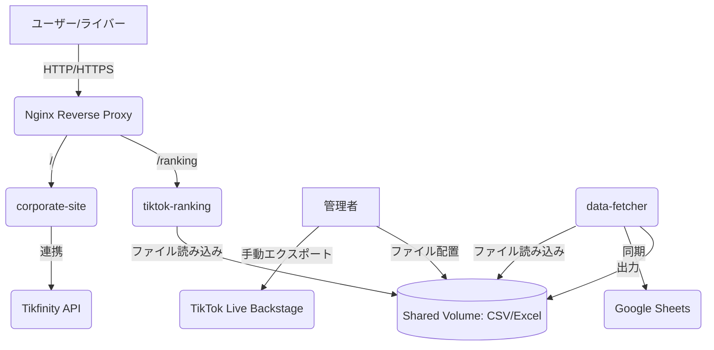

# TikTokライバーマネジメントシステム 基本設計書

## 1. はじめに
本ドキュメントは、「TikTokライバーマネジメントシステム」の要件定義書に基づき、システムの基本的な設計方針、構成、データ設計、非機能要件を記述する。

### 1.1 設計方針
本リポジトリはシステム全体の構成を管理する「親リポジトリ」であり、各サービスの具体的な仕様や詳細な要件定義は、Git Submoduleとして紐付けられた各サービスのリポジトリ側で管理する。これにより、ドキュメントの二重管理を防止する。

### 1.2 規約遵守 (Compliance)
本システムは、TikTok Pte. Ltd.が定める「Live Backstage利用規約」を遵守して運用される。特に、第2条に定める「補充規約（TikTokエージェンシー管理ポリシー等）」に基づき正当な権限を付与された法人ユーザーが、業務効率化の範囲内で利用することを前提とする。

## 2. システム構成

### 2.1 全体アーキテクチャ
本システムは、Docker Composeを用いたコンテナベースの構成を採用する。各機能は独立したGitリポジトリとして管理し、メインリポジトリ（本リポジトリ）にGit Submoduleとして集約する。運用保守の簡略化のため、専用のデータベースサーバーは構築せず、Googleスプレッドシート（管理者用）および共有ボリューム上のローカルファイル（CSV/Excel形式：ランキング表示用）をデータストレージとして活用する。

### 2.2 サービス構成とリポジトリ管理
以下の3つの独立したリポジトリをSubmoduleとして管理する。

1.  **corporate-site (Frontend):** 自社コーポレートサイト
2.  **tiktok-ranking (Frontend):** ライバー向けランキングサイト
3.  **data-fetcher (Worker):** データ加工・スプレッドシート同期 (Python)

### 2.3 アーキテクチャ図

### 2.4 Docker Compose構成
以下のサービスを構成する。
- `nginx`: リバースプロキシ。パスベースで各サイトへルーティングを行う。
- `corporate-site`: 自社HP用コンテナ。
- `tiktok-ranking`: ライバー向けランキングサイト用コンテナ。共有ボリュームを読み取り専用でマウント。
- `data-fetcher`: データ加工用コンテナ。手動配置されたファイルを読み込み、整形して出力。

※ 専用のDBコンテナ（PostgreSQL等）は構築しない。

## 3. 機能設計

### 3.1 自社コーポレートサイト
#### 3.1.1 会社概要表示
- **ページ構成:**
    - トップページ: 企業理念、最新情報
    - 会社概要ページ: 事業内容、アクセス、沿革など
    - ライバー紹介ページ: 所属ライバーのプロフィール、SNSリンク（個別のライバーページも検討）
    - 問い合わせページ: フォームからの問い合わせ機能
- **コンテンツ管理:**
    - 静的コンテンツを基本とするが、CMS（Contentful, microCMSなど）導入も将来的に検討。
    - ライバー紹介は管理画面から登録・編集できる機能をBackendに持たせる。

#### 3.1.2 Tikfinity連携ガチャ機能（corporate-site）
- **UI:**
    - ガチャを回すボタン、ポイント表示、景品表示（履歴含む）
    - ガチャ演出（アニメーション、サウンドなど）
- **ロジック:**
    - Next.jsのAPI Routesを使用し、サーバーサイドでTikfinity API（外部）と通信を行う。
    - **ポイント消費:** ユーザーがガチャ実行時、API Routes経由でTikfinityへポイント消費リクエストを送信。
    - **景品確定:** Tikfinity側で抽選された景品結果を取得し、フロントエンドへ返却。
- **データ管理:**
    - ガチャの景品マスターデータや排出確率は、ソースコード内の定数ファイルまたはGoogleスプレッドシート上の「Configシート」にて管理する。

### 3.2 活動状況データ加工・同期ツール（data-fetcher）
#### 3.2.1 処理プロセス
- **対象URL:** `https://live-backstage.tiktok.com/`（ログイン後のダッシュボード）
- **ツール:** Python (Pandas)
- **方針:** 規約第7条（自動化スクリプトの禁止）を遵守するため、データのエクスポートは正当な権限を持つユーザーがブラウザ上で手動で行う。本ツールはその後の整形・同期のみを担当する。
    1.  **手動エクスポート:** 管理者が Backstage から対象期間の Excel ファイルをダウンロードする。
    2.  **ファイル配置:** ダウンロードしたファイルを共有ボリュームの所定ディレクトリ（例: `./data/creators/raw`）へ配置する。
    3.  **データ加工:** プログラムを実行し、配置されたファイルを読み込み。必要な項目（ライバー名、配信時間、ギフト数等）の抽出・クレンジング、およびマスタ情報との紐付けを行う。
    4.  **出力:** 整形済みデータを `/app/data/ranking_data.csv` として出力する。
#### 3.2.2 Google スプレッドシート自動同期
- **連携方法:** Google Sheets API を利用。
- **認証:**
    - サービスアカウントキーファイルを使用し、OAuth2認証を行う。
    - **取得したデータは規約第10条（秘密保持）に基づき、第三者への漏洩を防ぐため、アクセス制限のかかったスプレッドシートおよびコンテナ環境で厳重に管理する。**
- **更新ロジック:** 管理者が分析しやすいよう、抽出した全データをスプレッドシートへ追記または最新状態に上書きする。
- **実行頻度:** 毎週月曜日の26:00 (JST) に自動実行。

### 3.3 ライバー向けランキングサイト（tiktok-ranking）
- **目的:** 所属ライバーが自身の活動状況や他ライバーとの比較を確認し、モチベーション向上に繋げる。
- **データソース:** 共有ボリューム上のファイル (`/app/data/ranking_data.csv`)。
- **UI:**
    - 週間ランキング: data-fetcherが生成した最新データを表示。
    - 簡易検索: 自身の名前でフィルタリング。
- **表示項目:**
    - 指標別ランキング（ギフト数、配信時間、平均視聴者数等）。
- **セキュリティ:**
    - **簡易認証:**
        - スプレッドシートで管理されているライバーごとのパスワード（または共通パスワード）による認証。
        - Next-Auth等のライブラリを使用し、データベースの代わりにスプレッドシートの情報を認証ソースとして利用する。
- **更新頻度:** 自動抽出ツールのデータ更新に合わせて、ランキングも自動更新。

## 4. データ設計

### 4.1 データストア構成
本システムでは専用DBサーバーを構築せず、以下の構成でデータを管理する。

1.  **Googleスプレッドシート (マスターデータ):**
    - `Liversシート`: ライバー名、TikTok ID、ランキングサイト用パスワード。**（規約第10条に基づき極秘情報として扱う）**
    - `Historyシート`: 過去からの全活動実績。
    - `Configシート`: ガチャ景品設定。
2.  **共有ボリューム上のローカルファイル (連携用):**
    - `ranking_data.csv`: ランキングサイト表示用の整形済みデータ。

## 5. 非機能設計

### 5.1 運用・保守性
- **Docker Compose:** 全てのサービスをコンテナ化し、開発・テスト・本番環境での一貫性を確保。環境構築の手間を削減。
- **ログ管理:** 各コンテナから標準出力されるログをDockerのロギングドライバーで管理。必要に応じてFluentd等と連携。
- **監視:** Prometheus + Grafana等によるシステムリソース（CPU, Memory）監視、アプリケーションログ監視。
- **コード品質:** Lint, フォーマッターの導入、テストコードの記述（ユニットテスト、結合テスト）。
- **ドキュメント:** APIドキュメント（Swagger/OpenAPI）、詳細設計書、運用手順書の整備。
- **TikTok仕様変更対応:** スクレイピング箇所は、TikTok Live BackstageのUI変更に影響を受けやすい。変更検知・修正プロセスを明確化。

### 5.2 拡張性
- **データモデル:** 将来的な項目追加に対応可能なよう、柔軟なスキーマ設計。
- **コンポーネント分離:** 各機能を独立したサービス（コンテナ）として設計することで、特定の機能の負荷増大時にもスケールアウトしやすい構成。
- **API設計:** RESTful APIの原則に従い、明確なインターフェースを定義。

### 5.3 性能
- **Frontend:** 静的サイト生成 (SSG) やサーバーサイドレンダリング (SSR) の活用による初回ロード時間の短縮。
- **Worker:** TikTokからのデータ抽出は負荷が高いため、実行時間を考慮した設計と定期実行スケジュールの最適化。

### 5.4 セキュリティ
- **認証・認可:**
    - 管理者ユーザー: パスワードポリシー、2FA導入検討。
    - ライバー: ランキングサイトへのアクセス認証。**（規約第10条に基づき、他者の機密情報が不適切に公開されないよう閲覧制限を行う）**
- **データ保護:**
    - データベースへのアクセス制限、通信経路のHTTPS化。
    - 機密情報（APIキー、パスワード）は環境変数またはSecret Managerで管理。
- **入力値検証:** 全てのユーザー入力に対して厳密な検証を実施し、SQLインジェクション、XSS等の脆弱性対策。
- **依存関係の管理:** 脆弱性を持つライブラリの使用を避けるため、定期的な依存関係のスキャン。

## 6. 技術的考慮事項（再確認・詳細化）

### 6.1 TikTok Live Backstage 規約遵守の徹底
- **課題:** 自動スクレイピング（規約第7条違反）によるアカウント停止リスク。
- **対策:**
    - **手動運用の原則:** データの取得元である TikTok へのアクセスおよびエクスポート操作は、常に正当な権限を持つ人間がブラウザを介して行い、自動スクリプトによる直接的なリクエストを完全に排除する。
    - **データ最小化:** 業務上必要な範囲内のデータのみを取り扱い、規約第10条（秘密保持）に則った管理を行う。

### 6.2 Tikfinity API 連携の詳細確認
- **課題:** ポイント消費や景品取得のためのAPIエンドポイントの有無、認証方式、レートリミット。
- **対策:** 事前にTikfinity運営への問い合わせ、APIドキュメントの入手と詳細な仕様確認。

### 6.3 データプライバシーとランキング表示の粒度
- **課題:** ライバーのセンシティブなデータ（収益に直結するギフト数など）の取り扱い。
- **対策:**
    - **表示項目調整:** ランキングはサマリ情報に留め、詳細な数値はライバー本人のみ閲覧可能とする。
    - **同意取得:** ランキング公開に関してライバーからの明確な同意を得る。
    - **匿名化/仮名化:** ランキング表示時の氏名やTikTok IDの取り扱い。

## 7. 今後の開発ロードマップ（予定）
1.  **フェーズ1: 基盤構築**
    - Docker Compose環境構築、Git Submoduleの設定、Nginxの設定。
    - TikTok Live Backstageからのデータ抽出 PoC (Proof of Concept) 実施。
2.  **フェーズ2: データ抽出・ランキング機能**
    - 手動取得データの取り込み・整形ロジック（Pandas）の実装。
    - Google Sheets APIとの連携（管理マスタ読み込み・活動実績の同期）。
    - 共有ボリュームへのランキング用データ出力処理の実装。
3.  **フェーズ3: フロントエンド構築・外部連携**
    - 自社コーポレートサイトの実装とTikfinityガチャ機能の統合。
    - ライバー向けランキングサイトの実装とファイル連携・簡易認証の構築。
4.  **フェーズ4: 運用開始・最適化**
    - 運用フロー（手動エクスポート → 指定フォルダ配置 → スクリプト実行）の確立。
    - ログ監視・Discord通知フローの稼働。
